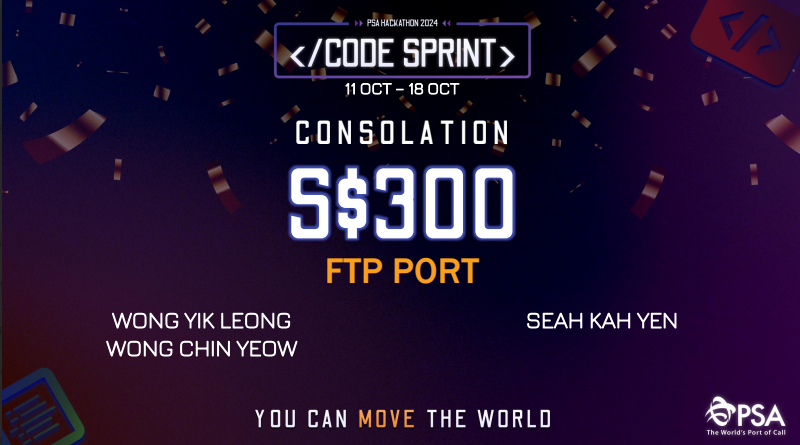
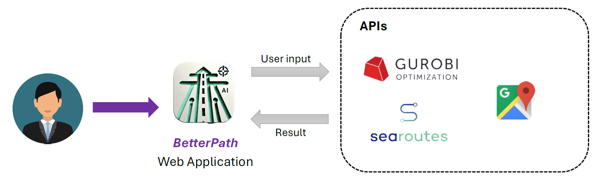
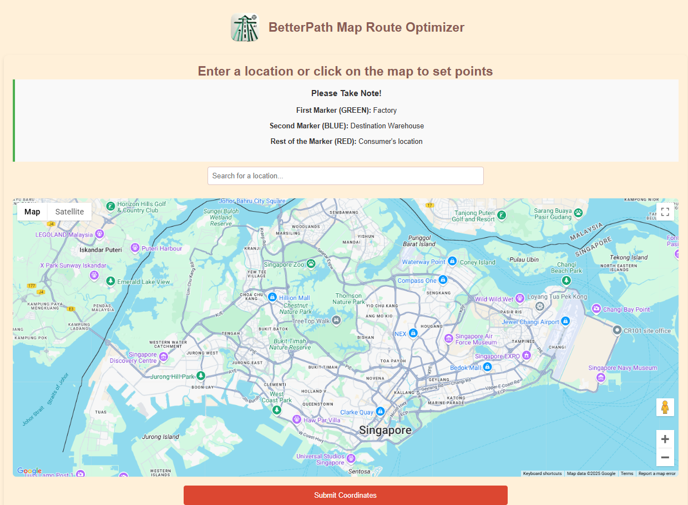
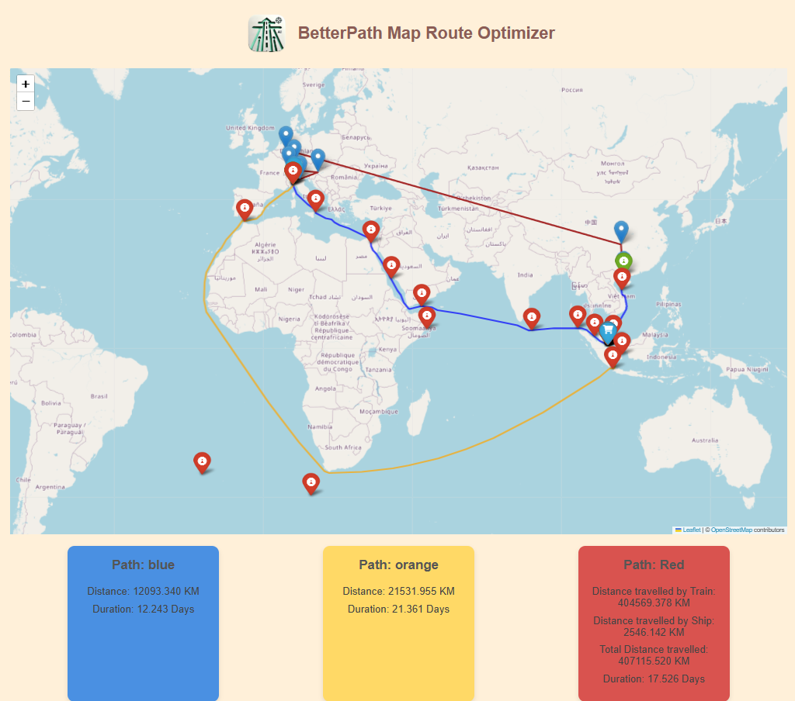
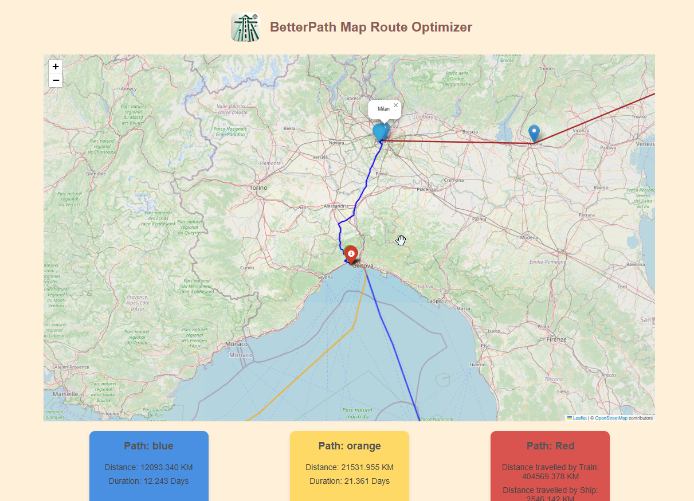
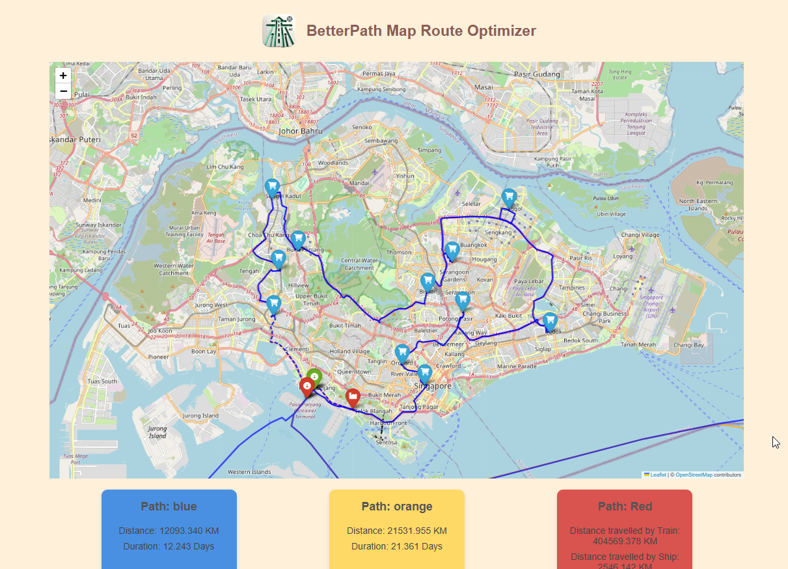

<div align="center">
  <a href="https://www.psacodesprint.com/code-sprint-2024">    
    
  </a>
</div>
<p align="left">
    <a href="https://www.psacodesprint.com/code-sprint-2024" target="_blank">        
        
    </a>
</p>

## 🗺️ BetterPath

Tackling <b> Theme 2: Efficient & Green Supply Chain</b> <br>
We have developed an AI-Optimized Route Planning web application, <b><i>BetterPath</b></i>, designed to assist in identifying the best routes via sea, train, or air.
Our application aims to optimize shipments in port operations, reduce emissions, and improve efficiency, aligning with PSA's goal of achieving a 50% reduction in emissions by 2030.

### 🛠️ Architecture 
<div align="center">
     <br>    
</div>

| API | Purpose | 
| --- | --- |
| `Gurobi Optimization` | Route optimization with linear programming |
| `Searoutes` | Route optimization for sea transportation |
| `Google Maps` | Real-time, real-world distance calculations using the latest maps |

### 📂 Files
| File name | Purpose | 
| --- | ------ |
| ./images | Contains images for `README.md` |
| ./manipulationFiles | Contains data files and Python scripts used for manipulating the data files in the `rail_nodes` folder. |
| ./rail_nodes | Contains data configurations for optimizing cargo railway operations. |
| ./static | Contains images used in <b><i>BetterPath Web Application</b></i> |
| ./templates | Contains home page used in <b><i>BetterPath Web Application</b></i> |
| ./app.py | Flask Web Framework for <b><i>BetterPath Web Application</b></i> |
| ./main.py | Code used to optimize route |

### ⏬ Setup 
1. The requirements.txt file should list all Python libraries that your notebooks depend on, and they will be installed using:
```
pip install -r requirements.txt
```
2. Download & retrieve the API keys required and replace the "REDACTED" in both `main.py` and `templates\front.html`.
3. Start the web server using:
```
python app.py
```

## Usage Demonstration 🤖

> [!Note]
> The characters and events depicted in this demonstration are fictitious.

### Demo Context 🗒️

Vincenzo runs a factory in Italy that manufactures high-demand products. Recently, he secured a major contract to deliver his goods to warehouses in Singapore. However, when he begins planning the delivery, he realises that the inner model logistics isn't as simple as he would hoped. There are various shipping options and complex routes, Vincenzo faces a dilemma. 

How to deliver his products to Singapore efficiently, cost-effectively and with minimal environmental impact. BetterPath would be able to solve this common yet significant challenge in the world of logistics.

### Vincenzo's workpath with BetterPath 📋

1. After Vincenzo fired up the web server, he accessed the web application and was greeted with the following:
<p align="center">    
  
</p>

2. BetterPath usage instruction is as follows: 
```
First Marker (GREEN): Factory
Second Marker (BLUE): Destination Warehouse 
Rest of the Marker (RED): Consumer's location 
```
Following the instructions, Vincenzo would need: 
- First Marker: Plot the first marker at his manufacturing factory in Italy: 
  - <i>Address</i>: Via Francesco Primaticcio, 155, 20147 Milano MI, Italy
- Next, plot the second marker on his importing factory in Singapore 
  - <i>Address</i>: Singapore 119967
- Last, plot the rest of the marker on different consumer's location in Singapore


<p align="center">    
  
</p>

3. Giving some time for the application to load and optimize the best paths, Vincenzo is presented with the following results:
<p align="center">    
  
</p>

<b> The detailed explanation of the results as follows: </b>

- Vincenzo is presented with three routes: 
  1. Blue: Shipping via the Suez Canal
  2. Orange: Shipping via the Cape of Good Hope
  3. Red: Shipping via cargo railway <br>
The estimated distance and duration for each route are listed at the bottom of the webpage.
<p align="center">    
  
</p>


- Both the blue and orange paths split from the closest port to the manufacturing factory, PSA Genova Terminal, with the difference being that shipping via the blue path goes through the Suez Canal.
<p align="center">    
  
</p>

- For the Red path (Shipping via railway), the route direction are as follows: 
  1. Using vehicle, deliver the goods from manufacturing factory to Milan Train Station
  2. Railway from Milan -> Verona -> St.Gotthard -> Basel -> Stuttgart -> Duisburg -> Chongqing -> QinZhou Port
  3. From QinZhou port, ship via the South China Sea to Singapore.
<p align="center">    
  
</p>


- All 3 paths will lead to Pasir Panjang PSA terminal, which is the closest port to the importing factory. BetterPath would then:
  1. Optimize the path from the Pasir Panjang PSA terminal to importing factory and
  2. From importing factory to the rest of the consumer's location. (Able to customize the number of delivery vehicles)

<p align="center">    
  
</p>

## Team Members 𖠋𖠋𖠋
👩🏻‍💻 [Yik Leong](https://github.com/bolasika) <br>
👩🏻‍💻 [Chin Yeow](https://github.com/cy12301) <br>
👩🏻‍💻 [Kah yen](https://github.com/seahkahyen) <br>
